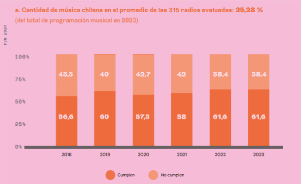
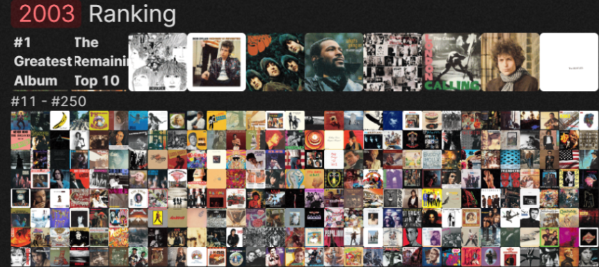
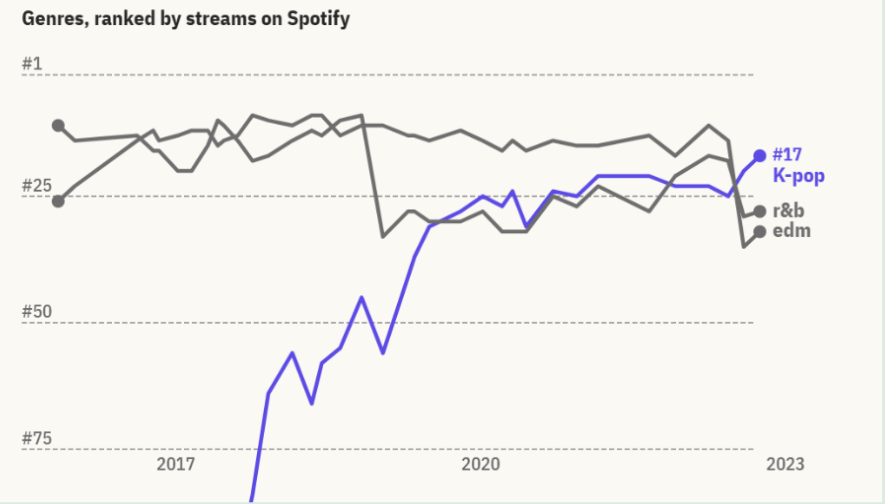

# Lefranc-Stier
# Proyecto Semestral:  Género Urbano en Chile: ¿Realidad o Percepción?"

### Sintesis: 

#### Se dice que Chile lleva varios años en una clara tendencia a la hora de definir sus preferencias musicales. El “género urbano” se ha consolidado como el estilo de música más popular entre el público chileno, especialmente entre los jóvenes. Este fenómeno ha sido discutido y respaldado con análisis, como lo fue un estudio realizado por parte de Spotify, donde Santiago de Chile fue nombrada la capital mundial de reggaeton por 4 años consecutivos.

#### Sin embargo, es esta explosión de popularidad que ha desplazado fuertemente a otros  géneros musicales tanto emergentes como aquellos que antes predominaban en el país, homogeneizando lo que suena tanto en radios como los artistas que lideran la cartelera de festivales y conciertos.

#### Aun así, existen varias voces de público nacional que alegan que el país no solo se limita al reggaeton o trap si no que existe una gran cantidad de oyentes chilenos quienes prefieren y consumen otros géneros musicales. Nuestro proyecto busca identificar las preferencias del público a través de datos concretos y cuantificables para finalmente comprobar realmente si el género urbano domina la escena nacional o si esta percepción está alejada de la realidad. 

## Hipotesis
#### El consumo musical en Chile está dominado casi exclusivamente por reggaetón y música urbana, lo que ha limitado la diversidad de géneros en las preferencias del público y ha reducido la visibilidad de otros estilos musicales.

## Antecedentes del tema:
### ¿Qué se ha publicado antes sobre el tema? ¿Con qué enfoque se han contado? ¿Cuáles son los hechos claves que se han presentado del problema?
#### Desde los medios se ha destacado el alza en el consumo y preferencias de los jóvenes ante el género urbano, lo han expuesto como un fenómeno tanto nacional como global. La expansión y creación de las plataformas de streaming como Spotify o Apple Music, según algunos analistas, ha ayudado al género bastante. Este género ha sido declarado como uno de los más escuchados en el país a raíz de distintos estudios realizados, uno por ejemplo el que realizó Spotify en 2019 al denominar a Santiago como la capital del reggaetón.
#### El enfoque con el que casi siempre se apunta al momento de hablar de la música urbana es uno bastante cultural, donde se elogia el estilo musical por su forma de expresión para los jóvenes, un sentido de libertad en el contexto de la marginalidad. Los hechos tangibles que se han desprendido de esta temática son el impacto que ha tenido en la industria, donde los festivales, las colaboraciones entre artistas y el uso de tendencias en redes sociales han catapultado esta música al centro del escenario de lo que vemos, escuchamos y consumimos a diario.

## Datos
### ¿Qué datos necesita para probar su hipótesis?
#### 1. El principal dato que necesitamos para esta investigación son aquellos sobre el consumo de la música urbana en distintas plataformas de streaming (Spotifty, Apple Music, Youtube) 
#### 2. Estadísticas que nos puedan demostrar la comparación entre la música urbana y cualquier otro género en relación a su cantidad de streaming
#### 3. Listas de popularidad o reproducciones de música en Chile en los últimos 10 años.
#### 4. Estadísticas sobre el rango etario de los oyente de la musica urbano 
#### 5. Datos sobre la reproducción de otros géneros a partir de los servicios de streaming 

## ¿Qué datos tiene y qué datos necesita conseguir aún?

### Datos que ya tenemos:
#### 1. Información sobre la popularidad del reggaeton/musica urbana en Chile
#### 2. Estudios hechos por servicios de streaming que destacan al país como un fuerte consumidor y exportador de música urbana
#### 3. Estadísticas de consumo de música en país en años anteriores
#### 4.Estadísticas de lo que se escuchan los distintos géneros que no son urbanos 

### Datos que nos faltan conseguir:
#### 1. Estadísticas recientes sobre el consumo de música urbana y otros géneros en las plataformas
#### 2. Datos sobre la popularidad de otros géneros en Chile a través de los años
### 3. Estadísticas sobre los rangos etarios de oyentes de música urbana
#### 4. Datos sobre la oferta de otros géneros musicales en Chile

## ¿Qué datos no existen y cómo los obtendrá?
#### 1. La evolución del consumo musical en Chile por sectores/regiones se podría conseguir mediante informes de la industria musical 
#### 2. Datos sobre de los géneros más escuchados en chile a través de los años podría conseguirse mediante una recopilación de datos aislados en plataformas

## ¿Qué datos son públicos y cuáles no?

#### 1. Los públicos son aquellos en las plataformas de streaming como Spotify, Apple Music y Youtube,informes anuales como los de la Sociedad Chilena del Derecho de Autor o datos de consumo global de música
#### 2. Los datos no públicos son aquellas estadísticas más específicas sobre regiones o sectores y también datos de productoras musicales sobre artistas emergentes y géneros en el país. 

## ¿Qué datos son confiables y cuáles no?
#### Los más confiables son los estudios de mercado y los informes que provengan de organismos oficiales. Los datos no confiables vendrían siendo las encuestas no representativas, las interpretaciones propias o notas de prensa sin respaldo estadístico. 

## Preguntas a responder:
#### 1.¿Cuáles son las preguntas que se pueden responder con los datos?
### 2. ¿Cómo han cambiado las preferencias musicales en Chile en la última década?
#### 3. ¿El consumo de música urbana es homogénea o varía según edades?
#### 4. ¿Qué otros géneros existen en Chile?
#### 5. ¿A parte del reggaeton que otros son los géneros más populares en Chile? ¿Es mucha la diferencia?
#### 6. ¿Qué porcentaje de oyentes escucha música que no pertenece al género urbano?
#### 7. ¿La oferta musical en Chile es solo música urbana o se producen otros géneros? ¿En qué cantidad?

# Historia visual:
## ¿Cuál es la historia de su proyecto de investigación? ¿Qué es lo nuevo?
#### El cómo la sociedad en Chile evolucionó en cómo consume música en comparación de años atrás. además de destacar el consumo masivo en los últimos años de artistas nacionales a través del país a diferencia de épocas pasadas lo popular en el país son los propios artistas nacionales, que además están teniendo un reconocimiento internacional a nivel mundial. Lo nuevo sería poder medir de manera clara, en cifras, que tanto se escuchan estos artistas y que otros géneros quedan más relegados 

## ¿Qué tipo de elementos digitales les gustaría tener? ¿Cómo esos elementos ayudarán a contar su historia? 

#### Nos gustaría utilizar gráficos comparativos interactivos que puedan visualizar de manera clara y divertida el contraste entre el porcentaje de consumo de la música urbana y otros géneros. [Referencia](https://www.scd.cl/content/uploads/2024/07/PAIS-DE-M%C3%9ASICOS_2023.pd)

#### Asimismo realizar un estilo de infografía o bloque con las canciones más populares en Chile en los últimos 10 años para demostrar con sus carátulas y posicionarlas en el primer y último lugar. [Referencia](https://pudding.cool/2024/03/greatest-music/) 

#### Otra herramienta que utilizaremos son líneas de tiempo para exponer el cambio de géneros predominantes en los últimos años para evidenciar a que se debe este boom de la musica urbana y  cuando comenzó su peak. [Referencia](https://pudding.cool/2023/10/genre/)

# Resultados:
## ¿Qué es lo mínimo que se puede contar como historia con los datos que tienen? 
#### Que las personas en Chile se están montando la ola nueva del “género urbano” y escuchan a estos artistas por mera moda y coyuntura de la música en español.

## ¿Qué es lo máximo?
#### Poder ejemplificar, explicar y graficar cómo estas nuevas generaciones chilenas han adoptado discursos muy diferentes a lo que acostumbramos a escuchar, haciendo música como nunca se había hecho teniendo un éxito a nivel mundial sin precedentes. También poder entender el origen de este movimiento y como ha sido un antes y un después en la cultura chilena, cambiando radicalmente el cómo se hace  y se consume la música en nuestro país.

